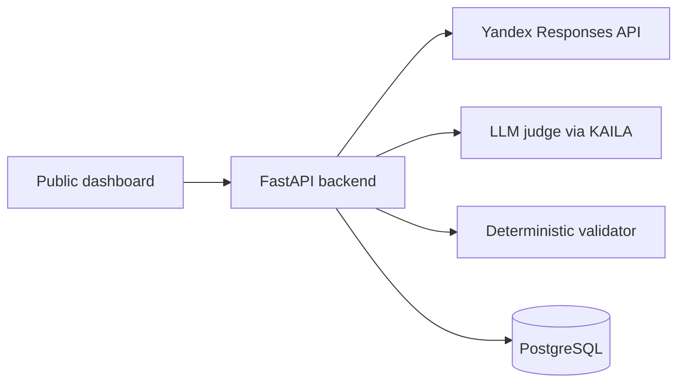

# Agent Regression Lab

Обновление 6 сентября: светлый интерфейс, история и сравнение, безопасная
остановка/удаление, промпт **судьи** judge-v2.0 и строгий JSON-контракт.
Основной агент не изменён.
[Отчёт об изменениях и миграция](CHANGE_REPORT.md) ·
[Контракт судьи и план проверки](JUDGE.md).

Публичный dashboard для воспроизводимой проверки `contractor-check-agent`:

- 40 основных сценариев;
- 16 повторов восьми boundary-сценариев;
- 3 сценария Web Search;
- 27 независимых диалогов и 86 вызовов агента вместе с setup-turns;
- оценка каждого ответа отдельной LLM-судьёй;
- независимая алгоритмическая проверка точных фактов и критических условий;
- ручная корректировка оценки с комментарием;
- метрики качества, latency, usage, citations и tool calls;
- сравнение версий промпта и моделей;
- PostgreSQL в облаке, SQLite локально.
- GitHub Actions: тесты, Docker build и smoke после деплоя.

## Архитектура



Просмотр результатов публичный. Запуск прогонов, остановка, удаление и ручное изменение
оценки требуют `ADMIN_TOKEN`. API-ключи никогда не передаются в браузер.

## Быстрый запуск

```bash
python -m venv .venv
source .venv/bin/activate       # Windows: .venv\Scripts\activate
pip install -r requirements-dev.txt
cp .env.example .env            # Windows: copy .env.example .env
```

Заполните в `.env`:

- `YANDEX_API_KEY` — ключ проверяемого агента;
- `JUDGE_BASE_URL` и `JUDGE_API_KEY` — OpenAI-compatible KAILA endpoint;
- `JUDGE_MODELS` — разрешённые модели через запятую;
- `ADMIN_TOKEN` — длинная случайная строка.

Затем:

```bash
uvicorn app.main:app --env-file .env --workers 1
```

Сайт откроется на `http://localhost:8000`. Без `DATABASE_URL` используется
локальный `regression.db`. Перед первым обновлением остановите прежний backend
и сохраните копию БД: при старте добавляется nullable provenance и фиксируются
прерванные задания. Подробности — в CHANGE_REPORT.md.

## Как устроен полный прогон

Основные пять вопросов каждой из восьми компаний идут в одном диалоге после
setup-turn. Каждый из 16 повторов boundary-сценариев и каждый из трёх Web
сценариев получает отдельный setup-turn. Итого: 59 оцениваемых ответов,
27 setup-turns и 86 API-запросов.

Диалоги продолжаются через `previous_response_id`. Одновременно выполняется не
более `MAX_CONCURRENCY` диалогов. Внутри одного диалога порядок строго
последовательный.

## LLM-судья

Backend отправляет судье вопрос, ожидаемые факты, обязательные основания,
запрещённые формулировки, условие критической ошибки, ответ агента, citations и
tool calls. Судья возвращает JSON с:

- `PASS / PARTIAL / FAIL / CRITICAL`;
- фактической корректностью и полнотой;
- покрытием источниками;
- полезностью и ложными отказами;
- вердиктами за пользователя;
- использованием и маркировкой Web Search;
- причиной оценки, пропусками и неподтверждёнными тезисами.

Модель выбирается на сайте только из серверного `JUDGE_MODELS`. Это защищает от
подстановки произвольной дорогой модели в публичном интерфейсе.

## Алгоритмическая проверка

Правила из `app/data/algorithmic_rules.json` проверяют точные ИНН, компании,
даты, суммы, статусы, уровни риска, обязательные факты и явно запрещённые
утверждения. Валидатор использует только стандартную библиотеку Python и не
оценивает стиль, полезность или качество источников.

LLM-статус остаётся основным. Только алгоритмический `CRITICAL` меняет итоговый
`auto_status` на `CRITICAL`; любое другое расхождение сохраняет LLM-статус и
выставляет `requires_manual_review=true`. Ручная оценка по-прежнему имеет
приоритет при отображении эффективного статуса.

## Экспорт отчётов

### CSV-экспорт полной таблицы результатов

Endpoint: `GET /api/runs/{run_id}/export/csv`

Скачивает CSV-файл со всеми результатами прогона:
- Исходные колонки и дополнительные: идентификация/версии/неполнота прогона,
  case_id, attempt, question, answer, отдельные статусы LLM/алгоритм/combined/manual/effective
- Алгоритмические детали: требуемые факты, запрещённые утверждения, критические флаги
- Готов для импорта в Excel, pandas, Google Sheets
- Кодировка UTF-8 с BOM для корректного открытия в Excel

**UI:** «Действия → Скачать CSV» у открытого прогона; CSV также доступен в истории.
Текстовые значения защищены от spreadsheet formula injection.

### PDF-отчёт (HTML для печати)

Endpoint: `GET /api/runs/{run_id}/export/pdf`

Скачивает HTML-отчёт с метриками качества:
- Release gate и прогресс выполнения
- Основные метрики: GTSR, factual correctness, completeness, source coverage
- Распределение статусов (LLM и алгоритмический)
- Алгоритмические метрики: покрытие фактов, запрещённые утверждения, CRITICAL-флаги
- Performance: latency (mean/median/p95/max)
- Стилизован для печати в PDF через браузер (Ctrl+P → Сохранить как PDF)

**UI:** «Действия → Отчёт / Печать в PDF». Возвращается HTML, не готовый PDF.

**Примечание:** HTML-формат выбран для гибкости — можно открыть в браузере и сохранить
как PDF встроенными средствами, либо использовать headless Chrome/Playwright для
автоматической генерации PDF в CI/CD.

## PostgreSQL / Supabase

1. Создайте бесплатный проект Supabase.
2. Скопируйте PostgreSQL connection string.
3. Укажите его как `DATABASE_URL` в формате `postgresql://...`.

Приложение автоматически создаст таблицы `runs` и `results` при старте.
Один worker удерживает session advisory lock; используйте прямое/session
соединение PostgreSQL, не transaction-mode pooler.

## Бесплатный деплой на Koyeb

1. Создайте GitHub-репозиторий и отправьте туда этот проект.
2. В Koyeb выберите **Create Web Service → GitHub**.
3. Выберите репозиторий и сборку через `Dockerfile`.
4. Выберите Free instance.
5. Добавьте все переменные из `.env.example` в Secrets/Environment Variables.
6. Для `DATABASE_URL` используйте строку подключения Supabase.
7. Проверьте `/api/health`: `agent_configured` и `judge_configured` должны быть `true`.

Важно: бесплатный публичный backend может «засыпать». Первый запрос после
простоя будет медленнее. История не потеряется, потому что она хранится во
внешнем PostgreSQL.

## Проверки

```bash
pytest -q
node --check app/static/app.js
python -m compileall -q app
node tests/browser-smoke.mjs
```

## Ограничения первого релиза

- Реальные CAILA/Yandex и калибровка judge-v2.0 требуют отдельной проверки.
- Фоновый runner рассчитан на один backend worker. Для нескольких worker или
  долгого production-процесса нужен отдельный job queue. Второй обновлённый
  worker отклоняется до восстановления задач; interrupted-прогоны не
  возобновляют платные запросы автоматически.
- Оценка LLM-судьи не считается абсолютной истиной: ручная корректировка и
  комментарий сохраняются отдельно, не уничтожая исходную оценку.
