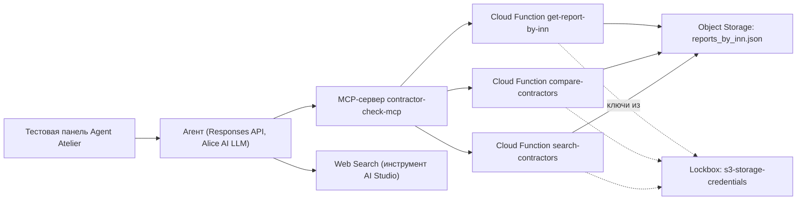

# Техническое задание на разработку MVP «Контрагент — по фактам»

**Статус:** актуальная версия под фактическую архитектуру (Yandex AI Studio + Yandex Cloud)
**Дата:** 4 сентября 2026 года
**Команда:** Команда 2
**Назначение:** заменить более раннюю версию документа (backend-оркестратор + серверный валидатор + изолированный MCP) на то, что реально спроектировано и развёрнуто: агент в Agent Atelier с MCP-сервером и Web Search, подключёнными напрямую как инструменты в Yandex AI Studio.

## 1. Цель и текущий статус

Создать MVP на базе Yandex AI Studio: агент, который по запросу пользователя находит контрагента, формирует сводку, отвечает на уточняющие вопросы и при необходимости дополняет ответ данными из открытых источников — без отдельного веб-приложения и без собственного backend.

`[Факт текущего статуса]` MCP-сервер с тремя инструментами и Web Search развёрнуты и подключены к агенту в Agent Atelier. Данные хранятся в Object Storage, читаются тремя Cloud Functions. Системный промпт актуализирован под реальный набор инструментов (документ 06). Полный прогон 56 тестовых ответов (документ 03/04) и оценочный интерфейс — не реализованы, оценка ведётся вручную.

MVP не принимает решение «работать / не работать», не рассчитывает собственный риск и не заменяет исходный отчёт. Пользовательская польза — меньше ручного чтения; польза для банка — основание для повторного использования продукта; надёжность AI — приоритет данных отчёта, явная маркировка внешних сведений и честная обработка пробелов, всё на уровне системного промпта.

## 2. Отличие от более ранней версии архитектуры

`[Решение]` Ранее рассматривался вариант с отдельным backend/оркестратором как единственным MCP-клиентом, изолированным инструментом без параметра `company_id` и серверной проверкой каждого поля ответа. Команда сознательно выбрала более простой путь под срок хакатона: **и MCP-сервер, и Web Search подключены как инструменты напрямую к агенту в Agent Atelier**, без промежуточного backend. Это быстрее в реализации и позволило собрать рабочий прототип за отведённое время, но меняет модель безопасности:

| Свойство | Версия с backend (не реализована) | Реальная версия (реализована) |
|---|---|---|
| Кто вызывает MCP | Backend, от лица сервера | Модель, напрямую |
| Изоляция компании | Инструмент без параметра `company_id`, компания — по серверной сессии | Инструмент `get-report-by-inn(inn)` с открытым параметром — модель технически может запросить любой ИНН |
| Проверка ответа модели | Отдельный валидатор путей/значений до показа пользователю | Нет отдельной проверки — ответ уходит пользователю сразу после генерации |
| Формат ответа | Строгий JSON Schema (`claims`/`evidence`/`data_gaps`/`next_actions`) | Свободный текст в Markdown по структуре, заданной промптом |
| Источник фактов | Только переданный отчёт, веб-поиск не подключён | Отчёт как приоритетный источник + Web Search как явно помечаемое дополнение, оба доступны модели напрямую |

Эта таблица — не список недостатков, а честная фиксация выбора: скорость реализации в обмен на более слабую техническую гарантию изоляции и корректности, компенсируемую промптом и ручным тестированием (документ 03).

## 3. Фактическая архитектура



Агент — единственная точка принятия решения о том, какой инструмент вызвать и в каком порядке. Он может в одном ответе обратиться к MCP за данными компании и к Web Search за дополнением, объединив оба результата в одном сообщении пользователю по правилам системного промпта.

Модель задаётся конфигурацией агента в Agent Atelier, а не кодом: **Alice AI LLM** — основная; резерв — `gpt-oss-120b`, DeepSeek V4 Flash или Qwen3 235B при необходимости переключения. В оценочном прогоне (документ 03) модель и параметры (температура 0.2–0.3) фиксируются на всё время прогона.

## 4. Компоненты и ответственность

| Компонент | Ответственность | Где реализовано |
|---|---|---|
| Агент | Диалог с пользователем, выбор инструмента, формирование сводки и ответа по правилам промпта | Agent Atelier, Responses API |
| MCP-сервер `contractor-check-mcp` | Единая точка доступа к трём инструментам работы с данными | MCP Hub |
| Cloud Function `get-report-by-inn` | Отдаёт полный отчёт по точному ИНН | Yandex Cloud Functions |
| Cloud Function `compare-contractors` | Отдаёт отчёты по списку ИНН для сравнения | Yandex Cloud Functions |
| Cloud Function `search-contractors` | Текстовый поиск компаний по названию/адресу/ОКВЭД | Yandex Cloud Functions |
| Object Storage | Хранение единого файла `reports_by_inn.json` (100 компаний, переиндексировано по ИНН) | Yandex Object Storage |
| Lockbox | Хранение статических ключей доступа к Object Storage | Yandex Lockbox, секрет `s3-storage-credentials` |
| IAM | Сервисные аккаунты с ролями `storage.viewer` (чтение данных) и `functions.functionInvoker` (вызов функций из MCP) | Yandex IAM |
| Web Search | Дополнение ответа сведениями из открытых источников, когда это уместно | Инструмент AI Studio, подключён к агенту |
| Ручной контур оценки | Прогон 40+8×2 вопросов, ручная сверка с отчётом, расчёт метрик | Таблица вне AI Studio (документ 03, раздел 5) |

`[Известное ограничение]` Строки «Валидатор» и «Backend / оркестратор» из более ранней версии документа отсутствуют как отдельные компоненты — их функции частично покрыты системным промптом (документ 06) и ручной проверкой при тестировании, но не автоматизированы.

## 5. MCP-контракт (реально развёрнутый)

### 5.1. `get-report-by-inn`

**Вход:**

```json
{ "inn": "строка ИНН, 10 или 12 цифр" }
```

**Выход:** полный JSON-отчёт выбранной компании (структура — см. документ 06, раздел 3) либо объект с `error`, если ИНН не найден.

### 5.2. `compare-contractors`

**Вход:**

```json
{ "inn_list": ["ИНН1", "ИНН2", "..."] }
```

**Выход:** `{ "reports": [ {...}, {...}, ... ] }` — массив отчётов (или объектов с `error` по каждому ненайденному ИНН), максимум 10 за вызов.

### 5.3. `search-contractors`

**Вход:**

```json
{ "query": "строка: название, часть адреса, ОКВЭД" }
```

**Выход:** `{ "results": [ { "inn", "name", "riskLevel", "address" }, ... ], "count": N }`, максимум 20 результатов.

Требования ко всем трём функциям:

- возвращать данные из `reports_by_inn.json` без изменений и без вычисления нового риска;
- различать ошибку «не найден» и техническую ошибку (недоступность Object Storage, ошибка парсинга);
- не логировать ключи доступа и содержимое секретов.

`[Известное ограничение]` Ни один из трёх инструментов не проверяет, что ИНН, который запрашивает модель, совпадает с компанией, которую пользователь назвал в текущем диалоге — эта проверка не реализована на уровне MCP или Cloud Function, только как инструкция агенту (документ 06, раздел 3).

## 6. Web Search как инструмент

- Подключён к агенту напрямую в Agent Atelier, без отдельной настройки на уровне MCP.
- Используется по решению модели, когда: (а) пользователь явно просит сведения вне отчёта («что нового?», «есть ли санкции?»); (б) агент считает уместным сверить контактные данные (сайт, адрес) с открытыми источниками.
- Приоритет данных отчёта над Web Search обеспечивается только системным промптом (документ 06, раздел 4) — нет технического ограничения, которое запрещало бы модели вызвать Web Search в любой момент.
- Результаты Web Search должны явно маркироваться в ответе как «по данным открытых источников» и не смешиваться текстуально с фактами отчёта.

## 7. Формат ответа агента (реальный, не строгий JSON Schema)

Агент возвращает Markdown-текст со структурой, заданной системным промптом:

```text
### Оценка рисков
- Уровень риска (банк): ...
- Уровень риска (ЗСК): ...
- Статус компании: ...

### Краткий вывод
...

### Ключевые риски
- ...

### Финансы
...

### Связанные компании (если заполнено)
...

### Рекомендация
...
```

Для ответа на уточняющий вопрос — краткий текст со ссылкой на раздел отчёта или пометкой источника (Web Search), без полной сводки.

`[Известное ограничение]` Это не машинно-валидируемый контракт: нет полей `claim_id`, `evidence[].path`, `state` и т.д. из более ранней версии документа. Соответствие структуре проверяется только при ручном тестировании (документ 03).

## 8. Обработка ошибок

| Ситуация | Поведение |
|---|---|
| ИНН не найден в MCP | Cloud Function возвращает `{"error": "..."}`; агент сообщает пользователю, что контрагент не найден, предлагает проверить ИНН |
| Ошибка доступа к Object Storage (Cloud Function) | Функция возвращает `statusCode: 500` с описанием ошибки; агент сообщает о технической ошибке, не выдаёт частичных данных |
| Web Search не вернул результатов | Агент сообщает, что подтверждённых сведений в открытых источниках не найдено — не выдумывает |
| Модель вернула ответ не по структуре промпта | Не перехватывается автоматически; проявляется как ошибка при ручном тестировании (документ 03) |

`[Известное ограничение]` Нет автоматического повтора генерации при некорректном ответе модели — это было предусмотрено более ранней версией документа как функция серверного валидатора, которого сейчас нет.

## 9. Нефункциональные требования

| Область | Требование | Статус |
|---|---|---|
| Безопасность | Ключи доступа к Object Storage — только в Lockbox, не в коде функций | Реализовано |
| Безопасность | Изоляция компании за диалогом | Только на уровне промпта, известное ограничение |
| Наблюдаемость | Логи вызовов Cloud Functions (RequestID, длительность, ошибки) | Реализовано через встроенные логи Cloud Functions |
| Наблюдаемость | Единый `request_id` сквозь весь путь агент→MCP→функция | Не реализовано |
| Воспроизводимость | Модель и температура фиксируются на время оценочного прогона | Реализуется вручную через настройки агента в Agent Atelier |
| Производительность | Время ответа фиксируется по факту при тестировании | Ориентир 10–15 сек с учётом возможных вызовов MCP и Web Search в одном ответе |
| Переносимость | Модель заменяется через настройки агента без изменения промпта и MCP-контракта | Реализовано |

## 10. Функциональные критерии приёмки

| ID | Критерий |
|---|---|
| AC-01 | По точному ИНН агент через `get-report-by-inn` находит нужную компанию; при неоднозначном названии — уточняет через `search-contractors` |
| AC-02 | В рамках одного диалога агент работает с компанией, которую назвал пользователь, и не переключается на другую без явной просьбы |
| AC-03 | Сводка содержит все доступные предопределённые блоки и дату отчёта |
| AC-04 | Общий риск и ЗСК показаны отдельно, без нового рейтинга и объяснения нераскрытой формулы |
| AC-05 | Каждый показанный фактический тезис сопровождается указанием источника (раздел отчёта или Web Search) в тексте ответа |
| AC-06 | При проверке вручную — показанные значения совпадают с данными в `reports_by_inn.json` |
| AC-07 | Запрос о другой компании, вердикт или неизвестная формула риска получает корректный отказ |
| AC-08 | `0`, `null`, `[]` и отсутствующее поле не смешиваются в ответах агента |
| AC-09 | Сведения из Web Search явно помечены и не подаются как факт отчёта |
| AC-10 | Сравнение нескольких компаний через `compare-contractors` показывает факты без вердикта о «победителе» |
| AC-11 | Ошибка MCP (ИНН не найден, техническая ошибка) не приводит к выдуманному ответу — агент сообщает об ошибке |

## 11. Порог готовности

Соответствует документу 03, раздел 6 — запуск 40 фиксированных вопросов один раз и 8 неответимых ещё дважды (56 ответов), плюс аддендум из 3 сценариев на Web Search (документ 04, раздел 4), оценка вручную по шаблону из документа 03, раздел 5.

Неподтверждённый существенный тезис, смешение компаний/рисков, подмена факта отчёта данными Web Search без пометки, или вердикт считаются критической ошибкой независимо от средних метрик.

## 12. Направления развития после хакатона

- Backend-обёртка над MCP с изоляцией сессии и без открытого параметра `company_id` в инструменте, доступном модели.
- Серверный валидатор путей и значений до показа ответа пользователю.
- Строгий структурированный формат ответа (JSON Schema) вместо свободного Markdown.
- Автоматизированный оценочный контур с LLM-судьёй и сохранением полного набора полей на каждый тестовый ответ.
- Полноценный веб-интерфейс вместо тестовой панели Agent Atelier.

Это не «недоделанный MVP» — это осознанно отложенные шаги повышения строгости системы после подтверждения продуктовой ценности на прототипе.
